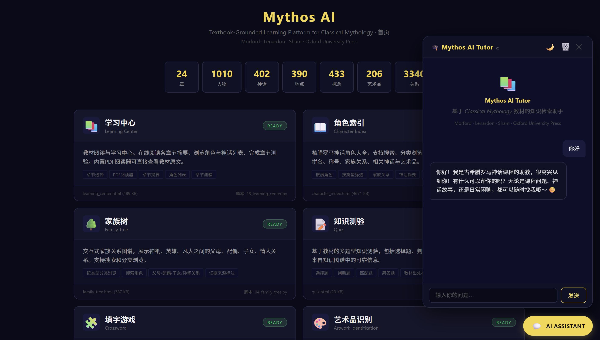
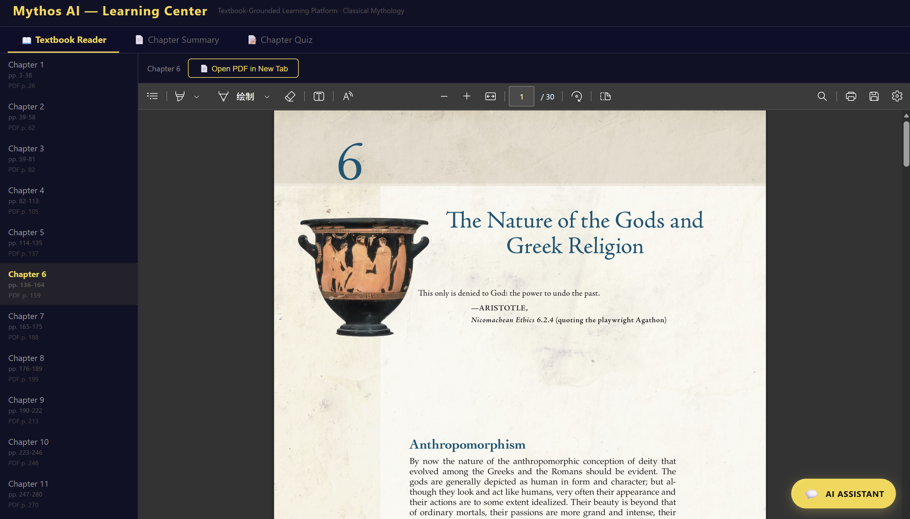
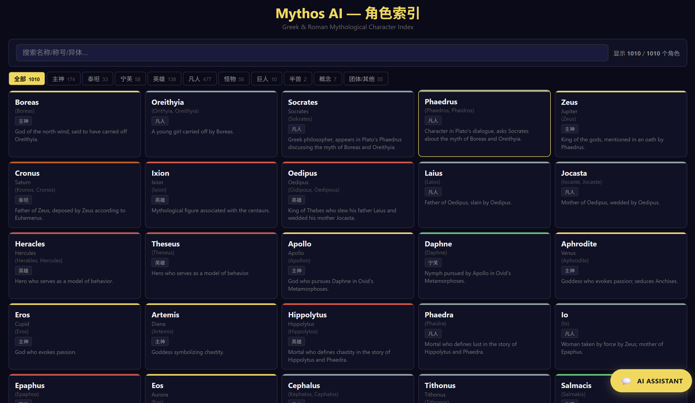
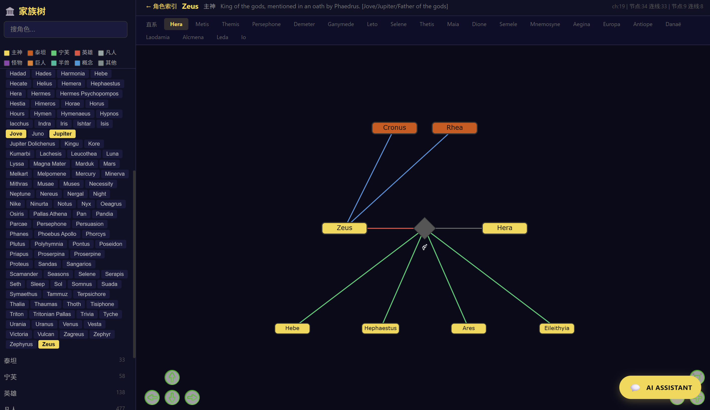
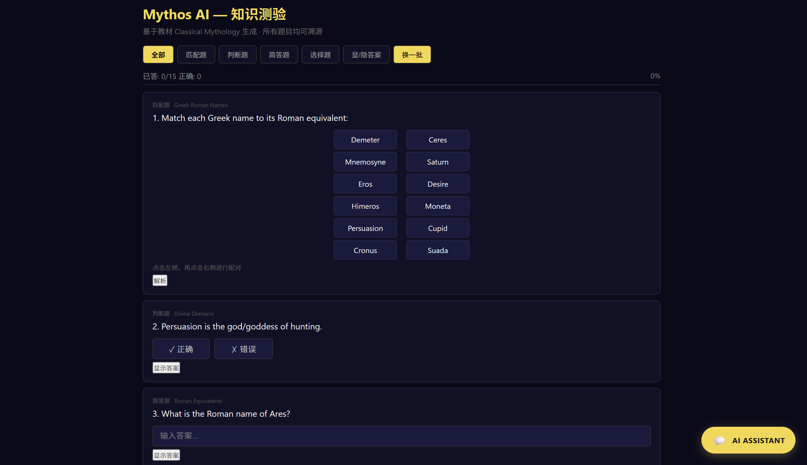
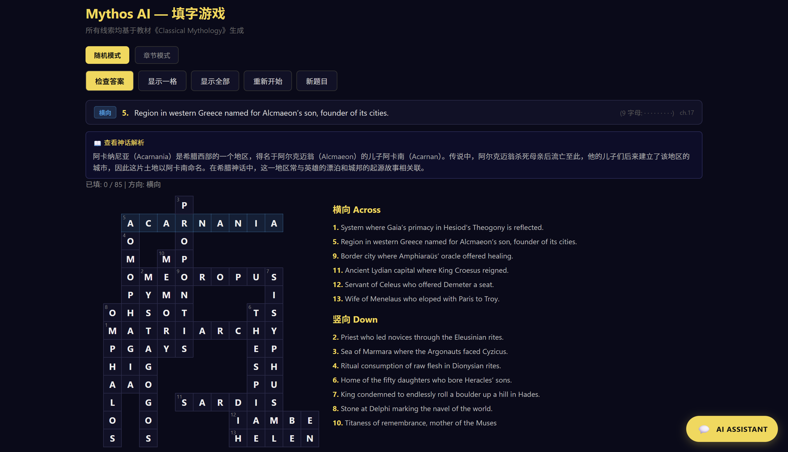
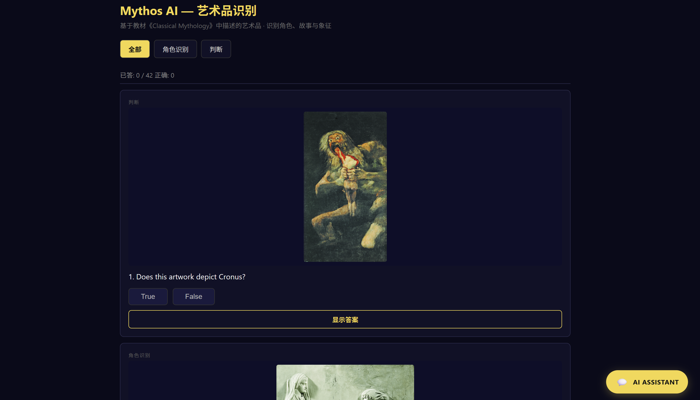
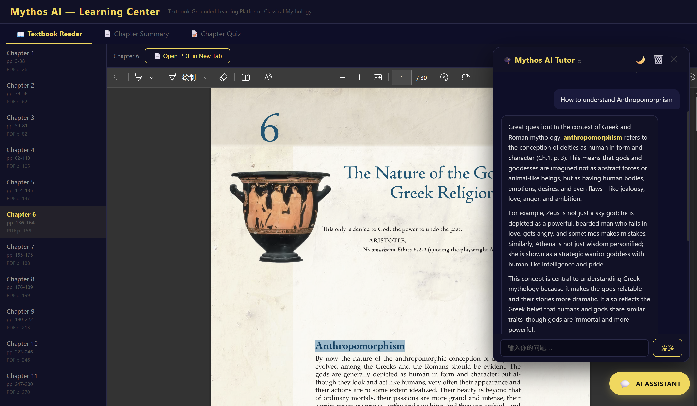

# Mythos AI 使用手册

---

## 目录

1. [系统概述](#1-系统概述)
2. [线上模式 vs 线下模式](#2-线上模式-vs-线下模式)
3. [快速开始](#3-快速开始)
4. [功能模块详解](#4-功能模块详解)
5. [AI Tutor 使用指南](#5-ai-tutor-使用指南)
6. [管理员指南](#6-管理员指南)
7. [常见问题](#7-常见问题)

---

## 1. 系统概述

### 界面预览

| 首页 | 学习中心 |
|:---:|:---:|
|  |  |

| 角色索引 | 家族树 |
|:---:|:---:|
|  |  |

| 知识测验 | 填字游戏 |
|:---:|:---:|
|  |  |

| 艺术品识别 | AI Tutor |
|:---:|:---:|
|  |  |

---

Mythos AI 是一个基于教材《Classical Mythology》（Morford, Lenardon, Sham · Oxford University Press）的 AI 辅助教学系统，面向英语语言文学本科生的神话学课程。

### 架构

```
用户浏览器
  │
  ├── GitHub Pages（静态文件托管）
  │     ├── index.html               首页
  │     ├── learning_center.html     学习中心（含PDF阅读器）
  │     ├── character_index.html     角色索引
  │     ├── family_tree.html         家族树
  │     ├── quiz.html                知识测验
  │     ├── crossword.html           填字游戏
  │     ├── artwork_quiz.html        艺术品识别
  │     └── ai_tutor_widget.js       AI Tutor 组件
  │
  └── Render（后端 API，可选项）
        └── ai_tutor_server.py       RAG + LLM 引擎
              └── DeepSeek API
```

### 核心数据

| 数据项 | 数量 |
|--------|------|
| 角色 | 1010 |
| 神话 | 402 |
| 地点 | 390 |
| 概念 | 433 |
| 艺术品 | 206 |
| 关系 | 3340 |

---

## 2. 线上模式 vs 线下模式

| 特性 | 线上模式 | 线下模式 |
|------|---------|---------|
| 访问方式 | 浏览器打开 GitHub Pages 链接 | 双击本地 `output/` 下的 HTML 文件 |
| PDF 阅读 | ✅ 按章节加载（~1.6 MB/章） | ✅ 同左 |
| 艺术品图片 | ✅ 从 GitHub 加载 | ✅ 同左 |
| AI Tutor 回答 | 🤖 **DeepSeek API 自然语言回答** | 🔍 **本地关键词搜索**（自动降级） |
| AI Tutor 速度 | 快（自动补全提示） | 中等（加载 1.5 MB 索引） |
| 网络要求 | 需要 | 不需要 |
| 适用场景 | 上课演示、学生自学、作业提交 | 离线学习、开发调试 |

> **注意**：AI Tutor 在线上模式会优先请求后端 API（需要后端运行），如果 API 不可用则自动降级为本地搜索模式。两种模式都能回答问题，区别在于回答质量。

---

## 3. 快速开始

### 3.1 线上模式

打开浏览器访问：

```
https://lanhui18115-than.github.io/mythos-ai/output/index.html
```

所有功能即开即用。

### 3.2 线下模式

**前提条件：** Python 3.10+

```bash
# 1. 安装依赖
pip install -r scripts/requirements.txt

# 2. 直接打开 HTML 文件（无需启动服务器）
# 双击 output/index.html 即可
```

**可选：启动 AI Tutor 后端（让回答更智能）**

```bash
# 确保 .env 文件已配置 API Key
py -3 scripts/ai_tutor_server.py
# 后端运行在 http://localhost:5800
```

---

## 4. 功能模块详解

### 4.1 首页（index.html）

**功能：**
- 系统概览与数据统计（1010 角色、3340 关系等）
- 6 个功能模块的导航入口
- 一键重新生成所有模块

**使用方法：**
1. 点击任意卡片进入对应模块
2. 页面底部的"重新生成"按钮用于管理员刷新内容

---

### 4.2 学习中心（learning_center.html）

**功能：**
- 24 章教材阅读（左侧章节列表 → 右侧 PDF 嵌入）
- 章节摘要（Tab 2）
- 章节测验（Tab 3，每章 3 套 × 10 题）

**使用方法：**

| 操作 | 步骤 |
|------|------|
| 阅读章节 | 左侧点击章节号 → 右侧加载对应 PDF |
| 切换阅读模式 | 点顶部 Tab：Reader / Summary / Quiz |
| 打开 PDF 新标签 | 点工具栏 "Open PDF in New Tab" |
| 做章节测验 | 切到 Quiz Tab → 选章节 → 开始答题 |
| 查看摘要 | 切到 Summary Tab → 选章节 → 浏览 |

**PDF 阅读技巧：**
- 每个章节的 PDF 独立加载（~1-3 MB），速度很快
- 点击章节后自动跳转到该章起始页
- 浏览器原生 PDF 查看器支持搜索、缩放、翻页

---

### 4.3 角色索引（character_index.html）

**功能：**
- 1010 个角色的搜索与浏览
- 分类筛选（神祇、英雄、凡人、怪物等）
- 角色详情：希腊名/罗马名、称号、领域、符号、家族关系、相关神话、艺术品

**使用方法：**

| 操作 | 步骤 |
|------|------|
| 搜索角色 | 顶部搜索框输入名称（中英文皆可） |
| 按类型筛选 | 点击分类按钮（全部/神/英雄/凡人/怪物···） |
| 查看详情 | 点击角色卡片 → 展开完整信息 |
| 查看艺术品 | 详情页底部的 Artworks 区域 |
| 查看出处 | 每条信息后标注 Chapter/Page 引用 |

**搜索提示：**
- 支持中文搜索（如"宙斯"）和英文搜索（如"Zeus"）
- 支持罗马名搜索（如"Jupiter"）
- 支持异体拼名搜索

---

### 4.4 家族树（family_tree.html）

**功能：**
- 交互式家族关系图谱
- 支持搜索和分类浏览
- 展示父母/配偶/子女/孙辈关系

**使用方法：**

| 操作 | 步骤 |
|------|------|
| 浏览图谱 | 鼠标拖拽平移，滚轮缩放 |
| 聚焦角色 | 搜索角色名 → 自动定位 |
| 查看关系 | 悬停或点击节点 → 显示关系详情 |
| 筛选类型 | 使用顶部的分类筛选按钮 |
| 查看证据 | 关系线下方显示教材章节引用 |

---

### 4.5 知识测验（quiz.html）

**功能：**
- 四种题型：选择题、判断题、匹配题、简答题
- 每题标注教材出处
- 自动评分 + 显示正确答案

**使用方法：**

| 操作 | 步骤 |
|------|------|
| 选题型 | 点击顶部题型标签切换 |
| 选择章节 | 下拉菜单选择章节范围 |
| 答题 | 点击选项/输入答案 |
| 查看结果 | 提交后显示对错 + 正确答案 + 教材引用 |
| 换一批 | 点"下一题"或刷新页面 |

---

### 4.6 填字游戏（crossword.html）

**功能：**
- 自动生成填字网格
- 线索来自教材知识
- 键盘导航 + 检查答案 + 提示功能

**使用方法：**

| 操作 | 步骤 |
|------|------|
| 选单元格 | 鼠标点击或方向键导航 |
| 填词 | 直接键盘输入字母 |
| 切换方向 | 空格键切换 Across/Down |
| 查看线索 | 右侧或底部线索面板 |
| 检查答案 | 点 Check 按钮 |
| 获取提示 | 点 Hint 按钮 |
| 换一题 | 点 New Puzzle |

---

### 4.7 艺术品识别（artwork_quiz.html）

**功能：**
- 基于教材中的 206 件艺术品
- 三种题型：角色识别、类型判断、描述匹配
- 点击图片可放大查看

**使用方法：**

| 操作 | 步骤 |
|------|------|
| 开始答题 | 页面加载后自动显示题目 |
| 查看图片 | 图片可点击放大/缩小 |
| 选择题 | 角色识别 / 类型判断 / 描述匹配 |
| 查看出处 | 每题回答后显示教材章节引用 |

---

## 5. AI Tutor 使用指南

### 5.1 基本操作

1. 点击页面右下角的 **AI ASSISTANT** 按钮
2. 聊天面板打开后，输入问题
3. 按 Enter 或点"发送"

### 5.2 提问示例

**推荐问题：**

| 问题类型 | 示例 |
|---------|------|
| 查询角色 | "Zeus 是谁？" / "Athena 有哪些称号？" |
| 查询神话 | "特洛伊战争的起因是什么？" |
| 查询关系 | "谁是 Zeus 的妻子？" |
| 查询地点 | "Delphi 在哪里？" |
| 查询概念 | "什么是 hubris？" |
| 查询艺术品 | "Laocoön 雕塑描绘了什么？" |
| 中文提问 | "谁是美杜莎？" / "阿喀琉斯的弱点是什么？" |

**不推荐的问题（超出教材范围）：**
- "比较希腊神话和北欧神话"（教材未涵盖北欧神话）
- "波塞冬在《海王》电影里是怎样的"（教材未涉及现代影视改编）

### 5.3 回答格式

AI Tutor 的回答包含：
- **基本信息**：角色/神话/概念的定义与描述
- **引用来源**：每条信息标注教材章节和页码（Ch.N pp. XX-XX）
- **相关链接**：相关角色、神话的交叉引用

### 5.4 回答模式对比

| 模式 | 工作方式 | 回答特点 |
|------|---------|---------|
| **在线（API）** | 检索知识图谱 → DeepSeek LLM 生成回答 | 自然流畅，像真人助教，有上下文理解 |
| **离线（本地）** | 检索知识图谱 → 关键词匹配返回结果 | 结构化列出匹配实体，回答机械但信息准确 |

两种模式的信息来源相同（教材知识图谱），区别仅在于回答的文风。

### 5.5 其他功能

- **清空对话**：点面板顶部的 🗑️ 图标
- **切换主题**：点 🌙/☀️ 图标切换深色/浅色模式
- **历史记录**：聊天记录自动保存在浏览器 localStorage，关闭页面不丢失

---

## 6. 管理员指南

### 6.1 重新生成所有页面

修改知识图谱后，运行以下命令按顺序生成所有页面：

```bash
py -3 scripts/14_build_tutor_index.py   # AI Tutor 索引
py -3 scripts/12_character_index.py     # 角色索引
py -3 scripts/13_learning_center.py     # 学习中心
py -3 scripts/04_family_tree.py         # 家族树
py -3 scripts/05_quiz_generator.py      # 测验
py -3 scripts/06_crossword_generator.py # 填字游戏
py -3 scripts/07_artwork_quiz.py        # 艺术品测验
```

或使用首页的"全部重新生成"按钮（需要后端支持）。

### 6.2 部署更新

```bash
git add .
git commit -m "更新说明"
git push
```

GitHub Pages 会自动重新部署（约 1-2 分钟）。

### 6.3 更新知识图谱

知识图谱文件位于 `data/knowledge_graph.json`。修改后需重新运行所有生成脚本。

### 6.4 更新教材 PDF

将新的 PDF 放入 `textbook/classical_myth.pdf`，然后运行：

```bash
# 重新切分章节 PDF
python -c "
import fitz, os
pdf_path = 'textbook/classical_myth.pdf'
out_dir = 'data/chapter_pdfs'
os.makedirs(out_dir, exist_ok=True)
chapters = [
    (1, 26, 61), (2, 62, 81), (3, 82, 104), (4, 105, 136),
    (5, 137, 158), (6, 159, 187), (7, 188, 198), (8, 199, 212),
    (9, 213, 245), (10, 246, 269), (11, 270, 303), (12, 304, 322),
    (13, 323, 356), (14, 357, 377), (15, 378, 406), (16, 407, 423),
    (17, 431, 459), (18, 460, 489), (19, 490, 539), (20, 540, 562),
    (21, 563, 576), (22, 577, 604), (23, 605, 629), (24, 630, 657)
]
doc = fitz.open(pdf_path)
for ch, ps, pe in chapters:
    ch_doc = fitz.open()
    ch_doc.insert_pdf(doc, from_page=ps-1, to_page=pe)
    ch_doc.save(f'{out_dir}/ch_{ch:02d}.pdf')
    ch_doc.close()
doc.close()
"
```

### 6.5 配置 AI Tutor 后端

在项目根目录创建 `.env` 文件：

```
LLM_API_KEY=你的API密钥
LLM_BASE_URL=https://api.deepseek.com
LLM_MODEL=deepseek-chat
```

启动后端：

```bash
py -3 scripts/ai_tutor_server.py
```

---

## 7. 常见问题

### Q: 为什么 AI Tutor 按钮没有显示？

A: 检查 HTML 文件末尾是否包含 `<script src="ai_tutor_widget.js"></script>`。如果缺失，重新运行对应的生成脚本。

### Q: PDF 加载不出来？

A: 
- 线上模式：检查网络连接，每个章节 PDF 大小约 1-3 MB
- 线下模式：确保 `data/chapter_pdfs/` 目录存在且有 PDF 文件

### Q: 艺术品图片不显示？

A: 
- 线上模式：图片已包含在 GitHub 仓库中，检查网络
- 线下模式：确保 `data/artwork_images/` 目录存在且有图片文件

### Q: AI Tutor 回答很机械？

A: 当前运行的是本地搜索模式。要获得更自然的回答，需要启动后端服务器（见 6.5 节）。

### Q: 如何更新测验题目？

A: 修改 `data/knowledge_graph.json` 后，重新运行 `py -3 scripts/05_quiz_generator.py`。

### Q: 支持移动端吗？

A: 所有页面采用响应式设计，支持手机和平板浏览。

---

**版本：1.0**
**最后更新：2026-07-24**
